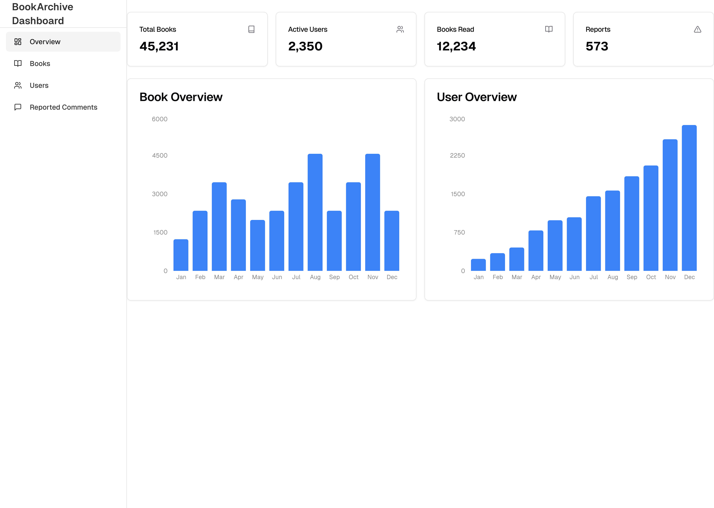

# Virtual Book Archive

## Members

| Name                | Student ID |
|---------------------|------------|
| Huỳnh Minh Khang    | SE192197   |
| Đặng Phương Nam     | SE192107   |
| Trương Lê Huy Hoàng | SE192052   |
| Nguyễn Anh Khoa     | SE192067   |

## Requirements

### System Name

**Virtual Book Archive**

### Purpose

The Virtual Book Archive provides a platform for users to read, share, and discuss e-books. It aims to create a community-driven digital library with easy access to a wide range of books.

### Target Users

- **Learners** – Students and self-learners looking for educational materials.
- **Book Enthusiasts** – Readers who enjoy exploring and discussing books.
- **Authors & Contributors** – Individuals who wish to share their own works.

### Functionality

#### Guest Users

- Search and filter books by title, author, genre, or keywords.  
- Read available books.
- Download books.
- View user profiles.
- Create a new user account.

#### Registered Users

Includes all guest functionalities plus:

- Log in and manage their account.
- Update profile.
- Upload books in supported formats.
- Rate books.
- Comment on books.
- Report inappropriate books or users.

#### Admin

- View and manage reported books and users.
- Remove users violating platform policies.  
- Remove books flagged as inappropriate or violating copyright.

## Wireframe or screenshots of the system

### GUIs
- Login page

- Create user page

- Home page

- Search page

- Summary page

- Read page

- User profile page

- User profile update page

- Admin overview page

- Admin book page

- Admin user page

### Site Map

